# Food Delivery Performance & Delay Analysis

## Project Overview

This project analyzes food delivery operations to identify the major factors affecting delivery time and delay risk. The goal is to help the business improve delivery efficiency, customer experience, rider allocation, and ETA planning.

The analysis covers data cleaning, feature engineering, exploratory data analysis, and 10 business questions focused on delivery delays, traffic, weather, distance, rider performance, batching, and operational planning.

> Note: This is a Zomato-style food delivery operations analysis. If the dataset is from Kaggle or another source, add the dataset source link in the repository.

---

## Business Problem

Food delivery companies need to deliver orders quickly while managing traffic, weather, rider workload, restaurant preparation time, and distance. Delays can reduce customer satisfaction and increase operational cost.

This project answers:

- What factors are driving delivery delays?
- How much do traffic, weather, distance, and multiple deliveries affect performance?
- Can high-risk deliveries be identified before they become delayed?
- When should the company deploy more riders?

---

## Dataset

The notebook expects a CSV file named:

```text
Zomato_Dataset_2.csv
```

Recommended repo path:

```text
data/Zomato_Dataset_2.csv
```

If the dataset cannot be shared due to licensing, add a dataset source link or instructions in the `data/README.md` file.

---

## Tools & Technologies

- Python
- Pandas
- NumPy
- Matplotlib
- Seaborn
- Geopy / geodesic distance
- Jupyter Notebook

---

## Key Feature Engineering

The following features were created for business analysis:

- `prep_time_minutes`
- `distance_km`
- `delivery_speed_kmph`
- `order_hour`
- `time_slot`
- `day_week`
- `is_weekend`
- `is_delayed`
- `distance_bucket`
- `prep_time_bucket`
- `high_risk_delivery`

---

## Data Cleaning Highlight

During distance calculation, some deliveries showed unrealistic distances above 6000 km. Investigation found incorrect negative latitude values in `restaurant_latitude`.

After correcting the latitude values and recalculating geodesic distance:

- Maximum distance reduced from around **6852 km** to **20.94 km**
- Distance distribution became realistic and analysis-ready
- Distance vs delivery time showed a weak-to-moderate positive relationship

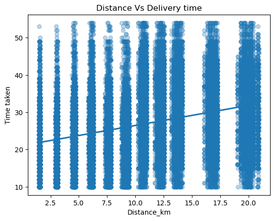

---

## Key Metrics

Recommended KPI section:

- Total Orders
- Average Delivery Time
- Median Delivery Time
- Delayed Order Percentage
- Average Distance
- Average Prep Time
- Average Delivery Speed

---

## Business Questions Covered

### 1. Delivery Performance Overview
Summarized total orders, average delivery time, median delivery time, min/max delivery time, and delayed order percentage.

### 2. What are the biggest drivers of delivery delays?
Analyzed traffic, weather, multiple deliveries, distance, and preparation time.

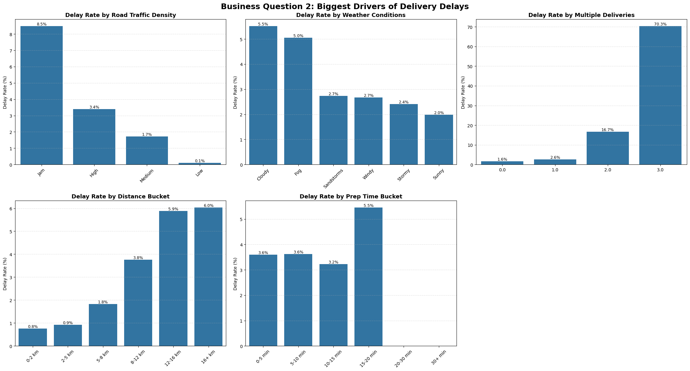

### 3. Are delays caused by restaurant preparation or delivery execution?
Compared preparation time, delivery time, and total customer time to separate restaurant-side and rider-side delay impact.

### 4. How much does delivery distance affect delivery time?
Analyzed average/median delivery time and delay rate across distance buckets.

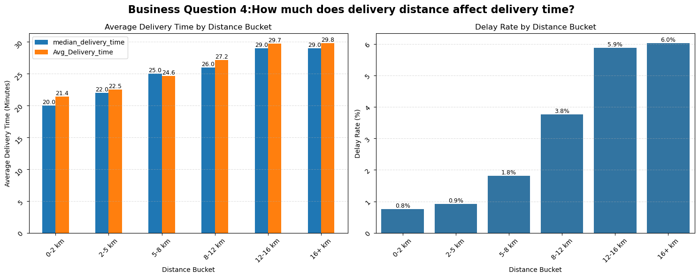

### 5. How severely does traffic impact delivery performance?
Compared delivery time and delay rate across Low, Medium, High, and Jam traffic.

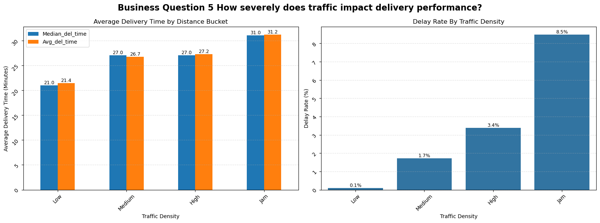

### 6. How does weather affect delivery efficiency?
Compared delivery time and delay rate across weather conditions.

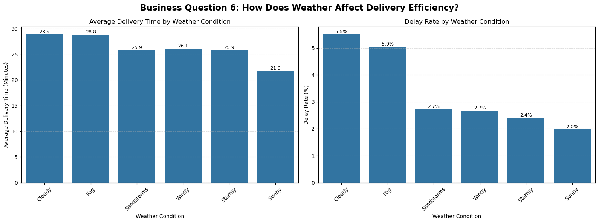

### 7. Does batching multiple orders improve efficiency or create delays?
Analyzed delay risk for single-order delivery versus additional multiple deliveries.

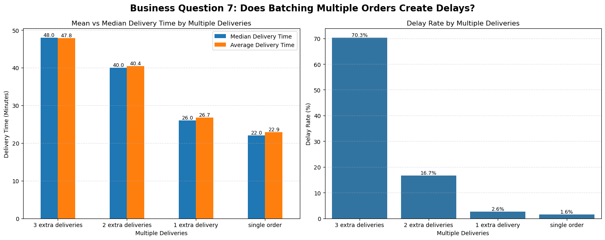

### 8. Can high-risk deliveries be identified?
Compared high-risk deliveries with normal deliveries.

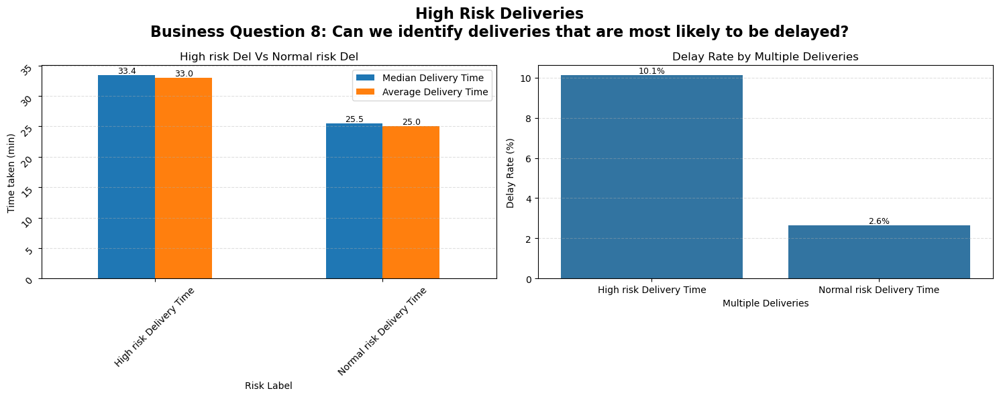

### 9. Do rider characteristics influence delivery performance?
Analyzed rider rating, rider age, delivery speed, delivery time, and delay rate.

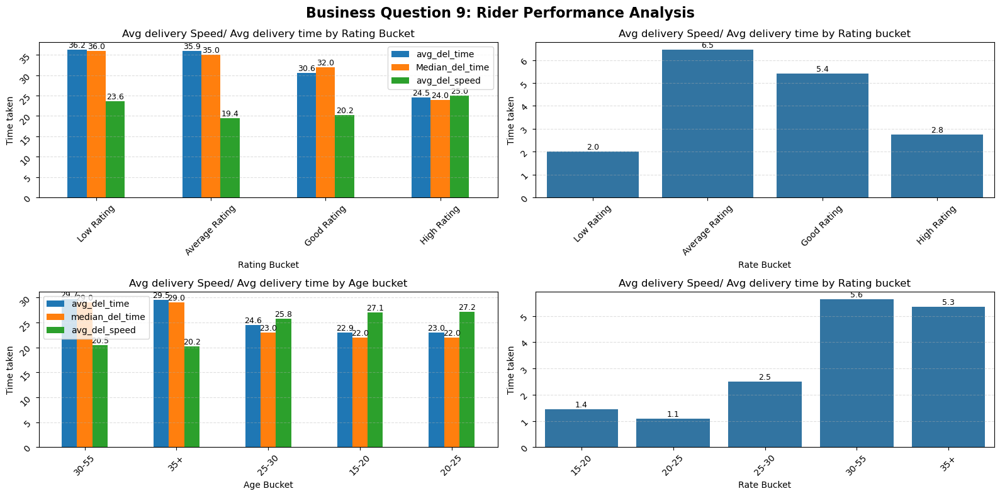

### 10. When should the company deploy more riders?
Analyzed order volume and delay rate by hour, time slot, day of week, and weekend flag.

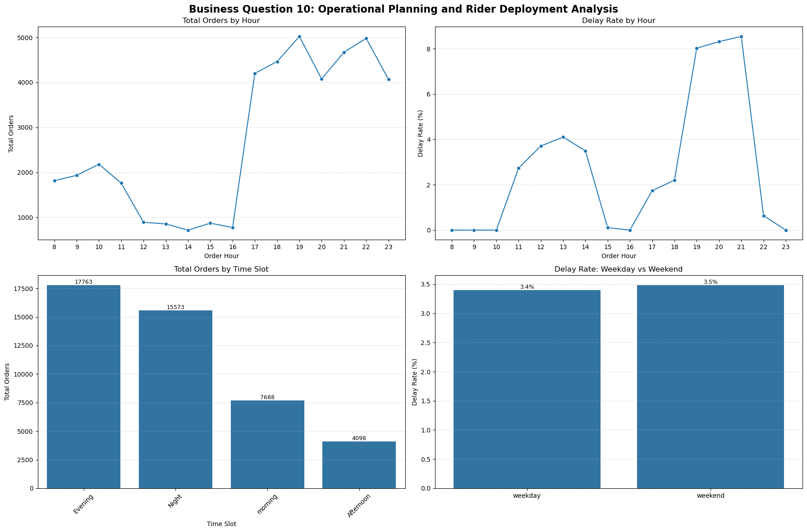

Additional root-cause heatmaps:

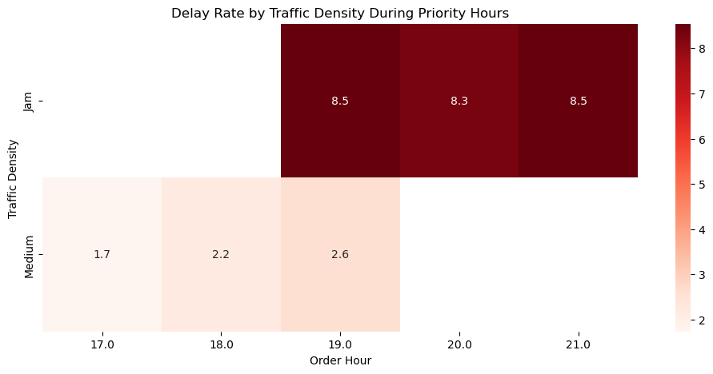

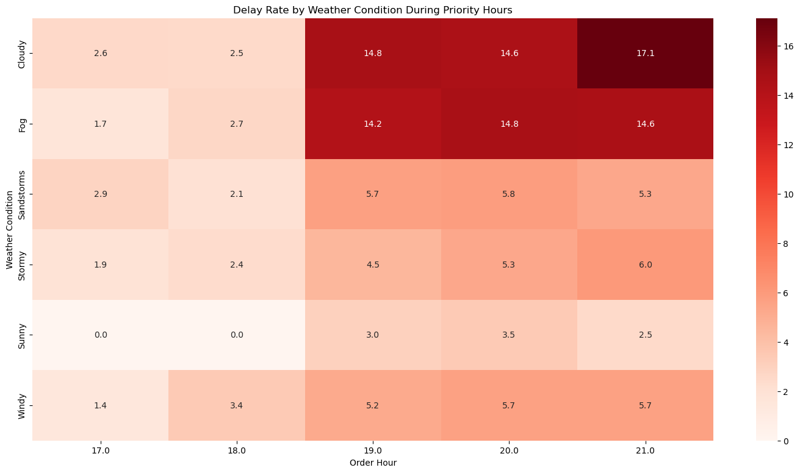

---

## Key Findings

- Multiple deliveries are the strongest delay driver. Orders with 3 multiple deliveries have the highest delay rate.
- Jam traffic significantly increases delivery time and delay risk.
- Cloudy and Fog weather conditions show higher delay rates than Sunny weather.
- Delay risk increases noticeably after 8 km.
- High-risk deliveries take longer and are much more likely to be delayed.
- High-rated riders generally complete deliveries faster, but rider performance should be evaluated along with traffic, distance, weather, and batching.
- Evening and night slots generate high operational pressure and require stronger rider planning.

---

## Business Recommendations

1. **Limit multiple-order batching during peak periods**
   - Restrict excessive batching when demand and delay risk are high.

2. **Increase rider allocation during jam traffic**
   - Deploy more riders in high-congestion zones and use dynamic route planning.

3. **Apply dynamic ETA adjustments during poor weather**
   - Adjust expected delivery time during Cloudy and Fog conditions.

4. **Monitor long-distance deliveries above 8 km**
   - Use better ETA estimates and experienced riders for long-distance orders.

5. **Prioritize high-risk deliveries**
   - Assign experienced riders and flag high-risk deliveries before dispatch.

6. **Use rider performance data for smarter assignment**
   - Combine rating, delivery speed, delay rate, and delivery context before rider assignment.

---

## Limitations

- Customer satisfaction ratings were not available.
- Distance was estimated using coordinates and may not represent actual road distance.
- Traffic and weather data were categorical, not real-time route-level data.
- Actual restaurant SLA data was limited.
- Some missing or unbucketed values may require additional handling.
- Real-time rider availability and live traffic conditions were not captured.

---

## Future Work

- Build a machine learning model to predict delayed deliveries before rider assignment.
- Create a real-time ETA prediction system.
- Develop a rider allocation optimization model for peak hours.
- Monitor restaurant preparation SLA.
- Build an interactive Power BI dashboard for operations monitoring.

---

## Recommended Repository Structure

```text
food-delivery-performance-analysis/
│
├── README.md
├── requirements.txt
├── Zomato_Delivery_Performance_Analysis.ipynb
│
├── data/
│   └── README.md
│
└── images/
    ├── distance_validation_scatter.png
    ├── delay_driver_analysis.png
    ├── distance_impact_analysis.png
    ├── traffic_impact_analysis.png
    ├── weather_impact_analysis.png
    ├── multiple_deliveries_analysis.png
    ├── high_risk_delivery_analysis.png
    ├── rider_performance_analysis.png
    ├── operational_planning_analysis.png
    ├── traffic_priority_heatmap.png
    └── weather_priority_heatmap.png
```

---

## How to Run

1. Clone the repository.
2. Install dependencies:

```bash
pip install -r requirements.txt
```

3. Place the dataset inside the `data/` folder.
4. Update the notebook CSV path if needed:

```python
df = pd.read_csv("data/Zomato_Dataset_2.csv")
```

5. Run the notebook from top to bottom.

---

## Author

**Jauwad Jamal**  
Data Analyst | SQL | Python | Power BI | EDA | Business Analytics
